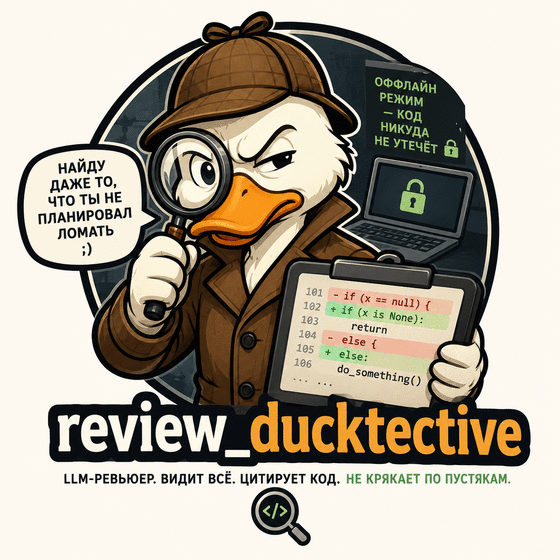

<p align="center">
  
</p>

<h1 align="center">review_ducktective</h1>

<p align="center">
  <b>LLM-ревьюер. Видит всё. Цитирует код. Не крякает по пустякам.</b>
</p>

---

Платформа автоматического code review на LLM: принимает дифф, возвращает находки,
привязанные к строкам кода, разложенные по уровням критичности и подтверждённые
цитатами из реального кода.

Работает в том числе полностью офлайн — кодовая база не покидает машину.

## Возможности

- **Ревью диффа** — параллельные специализированные проверки (корректность,
  безопасность, производительность, конвенции проекта) с верификацией находок.
- **RAG по кодовой базе** — AST-чанкинг через tree-sitter, граф символов,
  гибридный поиск (векторный + лексический) с реранкингом.
- **Diff-first retrieval** — контекст собирается от изменённого символа: что он
  вызывает и кто вызывает его. Модель видит последствия изменения, а не только дифф.
- **Чат по проекту** — вопросы в свободной форме со стримингом через WebSocket.
- **MCP-сервер** — инструменты навигации по коду для внешних агентов.
- **Air-gapped режим** — локальные модели через Ollama, ни одного запроса наружу.

## Стек

Python 3.12, FastAPI, LangGraph, SQLAlchemy 2.0 (async), PostgreSQL 17 + pgvector,
Redis, arq, LiteLLM, tree-sitter, React + TypeScript.

## Требования

- Python 3.12+
- [uv](https://docs.astral.sh/uv/)
- Docker и Docker Compose

## Быстрый старт

```bash
uv sync --all-packages

cp .env.example .env

docker compose --env-file .env -f deploy/compose/docker-compose.dev.yml up -d

uv run alembic upgrade head

uv run ducktective serve --reload
```

Фоновые воркеры (каждый в своём терминале):

```bash
uv run arq ducktective.reviewer.worker.WorkerSettings   # ревью
uv run arq ducktective.indexer.worker.WorkerSettings    # индексация
```

## MCP-сервер

Навигация по собранному индексу как набор инструментов для внешнего агента:
`search_code`, `get_definition`, `find_callers`, `get_file_context`.

По умолчанию транспорт stdio — клиент поднимает сервер сам. Рабочим каталогом
при этом оказывается каталог клиента, поэтому путь к `.env` указывается явно:

```bash
claude mcp add ducktective -- \
  /путь/к/review_ducktective/.venv/bin/ducktective-mcp \
  --env-file /путь/к/review_ducktective/.env
```

То же самое конфигурацией клиента:

```json
{
  "mcpServers": {
    "ducktective": {
      "command": "/путь/к/review_ducktective/.venv/bin/ducktective-mcp",
      "args": ["--env-file", "/путь/к/review_ducktective/.env"]
    }
  }
}
```

Отдельно живущий сервис поднимается тем же исполняемым файлом:

```bash
uv run ducktective-mcp --transport http --port 8090
```

Файл настроек задаётся ключом `--env-file` или переменной `DUCKTECTIVE_ENV_FILE`;
названный файл перекрывает окружение. Тенант — ключом `--tenant` или
`MCP_TENANT_ID`: у stdio нет идентичности вызывающего, и сервер работает от того,
кто его запустил. Репозиторий инструменты принимают именем или идентификатором.

## Индексация

Перед тем как ревью сможет опираться на кодовую базу, её нужно разобрать:

```bash
ducktective index .                    # текущая ревизия
ducktective index . --revision HEAD~5  # любая другая
ducktective index . --skip-embeddings  # без векторов: разбор и граф модели не требуют
```

Из интерфейса индексация запускается там же, где заводится дело: под выбором
репозитория видно, собран ли индекс, и его можно обновить, не уходя в терминал.
Без индекса ревью всё равно пойдёт — но по одному диффу, без окружения, и
интерфейс об этом скажет.

Повторный запуск разбирает только изменившиеся файлы — хеши берутся у самого
git, поэтому неизменившийся файл даже не читается. Векторы считаются локальной
моделью эмбеддингов (`LOCAL_EMBEDDING_MODEL`, `LOCAL_EMBEDDING_BASE_URL`); если
она недоступна, индекс всё равно строится, а векторы досчитаются при следующем
запуске.

## Оценка качества

Наборы случаев с заранее известными ответами лежат вне репозитория — в них код,
которому там не место. Прогон считает recall по внесённым дефектам и долю ложных
тревог на заведомо чистых диффах:

```bash
ducktective eval набор.json --label baseline --repeat 3 --save

# с контекстом из индекса — так измеряется эффект ретривала
ducktective eval набор.json --label with-context --repeat 3 \
  --repository . --tenant <id> --save
```

`--repeat` не для надёжности: модель отвечает на один и тот же запрос
по-разному, и одиночный прогон меряет удачу. В отчёте печатается разброс
рядом со средним, а строка «случаев с контекстом» показывает, действительно
ли индекс участвовал, — прогон «с контекстом», где он не собрался, обязан
выдавать себя.

## Ревью из терминала

Автономный режим: без базы, без Redis, без запущенного API. Нужна только локальная
модель — код никуда не уходит.

```bash
# то, что собираешься коммитить
ducktective review --staged --no-store

# диапазон ревизий
ducktective review /path/to/repo --no-store --base HEAD~1 --head HEAD

# отчёт для описания pull request
ducktective review --staged --no-store --format markdown
```

Форматы вывода: `rich` (по умолчанию), `json`, `markdown`.

Большой коммит можно сузить до нужной части — `--include` принимает шаблоны
и повторяется несколько раз. `*` покрывает и разделители каталогов, поэтому
`src/report/*` найдёт файлы на любой глубине:

```bash
ducktective review /path/to/repo --no-store \
  --base a1b2c3d~1 --head a1b2c3d \
  --include 'src/report/*' --include '*.py'
```

С флагом `--fail-on` команда возвращает ненулевой код, если найдены проблемы
указанного уровня или выше — это делает её пригодной для git-хука и для CI:

```bash
ducktective review --staged --no-store --fail-on major
```

```yaml
# .pre-commit-config.yaml
- repo: local
  hooks:
    - id: ducktective
      name: ducktective
      entry: ducktective review --staged --no-store --fail-on critical
      language: system
      pass_filenames: false
```

Режим с хранением (без `--no-store`) пишет прогоны и находки в базу, требует
`--tenant` и поднятой инфраструктуры — он нужен, чтобы размечать находки
и накапливать данные для оценки качества.

Проверка: http://localhost:8000/health, документация API: http://localhost:8000/docs

## Интерфейс

```bash
cd apps/web
npm install
npm run dev
```

Откроется на http://localhost:5173, запросы к API проксируются на порт 8000 —
CORS настраивать не нужно. Тенант задаётся переменной `VITE_TENANT_ID`, адрес
бэкенда — `VITE_API_TARGET`.

Дифф показывается по изменённым блокам; свёрнутые участки между ними
раскрываются по требованию — строки читаются из ревизии, а не приходят
вместе с патчем.

Раздел «отметки» собирает всё, что было размечено кнопками на карточках
находок: сколько подтверждено, сколько признано ложным следом и какая
получается доля подтверждённых. Это материал для оценки качества ревьюера,
и без него разметка копилась бы вслепую.

Шрифты подключены пакетами и раздаются с того же хоста: интерфейс не обращается
к внешним CDN, как и остальная система.

```bash
npm run build       # сборка
npm run typecheck   # типы
npm run codegen     # обновить типы API из openapi.json
```

Схема API пересобирается из приложения:

```bash
uv run python -c "import json; from ducktective.api.main import create_app; \
  print(json.dumps(create_app().openapi(), ensure_ascii=False))" > apps/web/openapi.json
```

## Миграции

```bash
uv run alembic upgrade head
uv run alembic revision --autogenerate -m "описание"
uv run alembic downgrade -1
```

Alembic читает `DATABASE_URL` из окружения — переменную нужно экспортировать
или запускать команды через `uv run --env-file .env`.

## Разработка

```bash
uv run pre-commit install --install-hooks
uv run pre-commit install --hook-type commit-msg   # проверка конвенции коммитов
uv run pytest                 # все тесты
uv run pytest -m "not integration"   # без контейнеров, быстро
uv run mypy .                 # типы
uv run lint-imports           # проверка границ слоёв
```

Форматирование — строго в этом порядке, isort первым:

```bash
uv run isort . && uv run ruff format . && uv run ruff check --fix .
```

Импорты оформляются по одному имени на строку в скобках (`force_grid_wrap = 1`).
Правило `I` в ruff сознательно отключено: ruff не поддерживает такой стиль,
за сортировку отвечает isort.

Коммиты — [Conventional Commits](https://www.conventionalcommits.org/), версия и
CHANGELOG формируются автоматически.

## Архитектура

Слоистый DDD: `apps` → `application` → `core` (домен). Инфраструктура реализует порты
домена. Доступ к данным — через репозитории агрегатов, границы транзакций — явный
Unit of Work. Правило зависимостей проверяется `import-linter` в CI.

```
packages/core          домен: агрегаты, value objects, события, порты
packages/application   use cases, границы транзакций
packages/storage       SQLAlchemy, репозитории, UnitOfWork, миграции
packages/indexing      tree-sitter, чанкинг, граф символов, эмбеддинги
packages/retrieval     гибридный поиск, реранкинг, diff-first retriever
packages/llm           LiteLLM, ModelRouter, кэш, structured output
packages/review_graph  узлы LangGraph и сборка графа
apps/api               FastAPI: REST + WebSocket
apps/indexer           воркер индексации
apps/reviewer          воркер ревью
apps/mcp_server        MCP-инструменты навигации по индексу
```

Решения уровня кода — в `docs/adr/`.

## Лицензия

MIT
