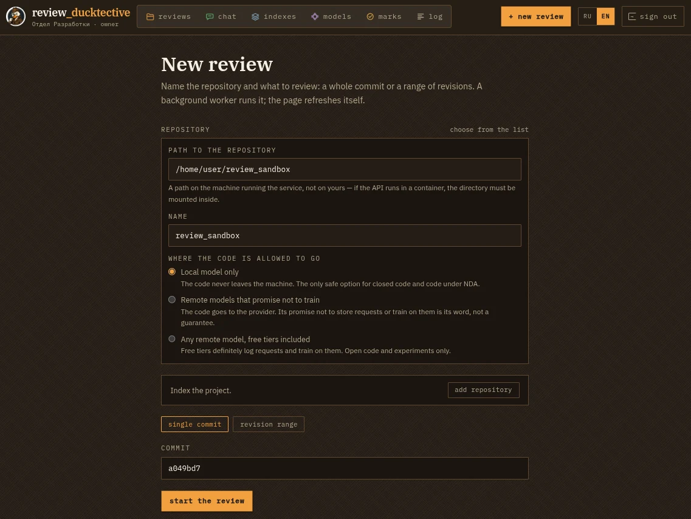
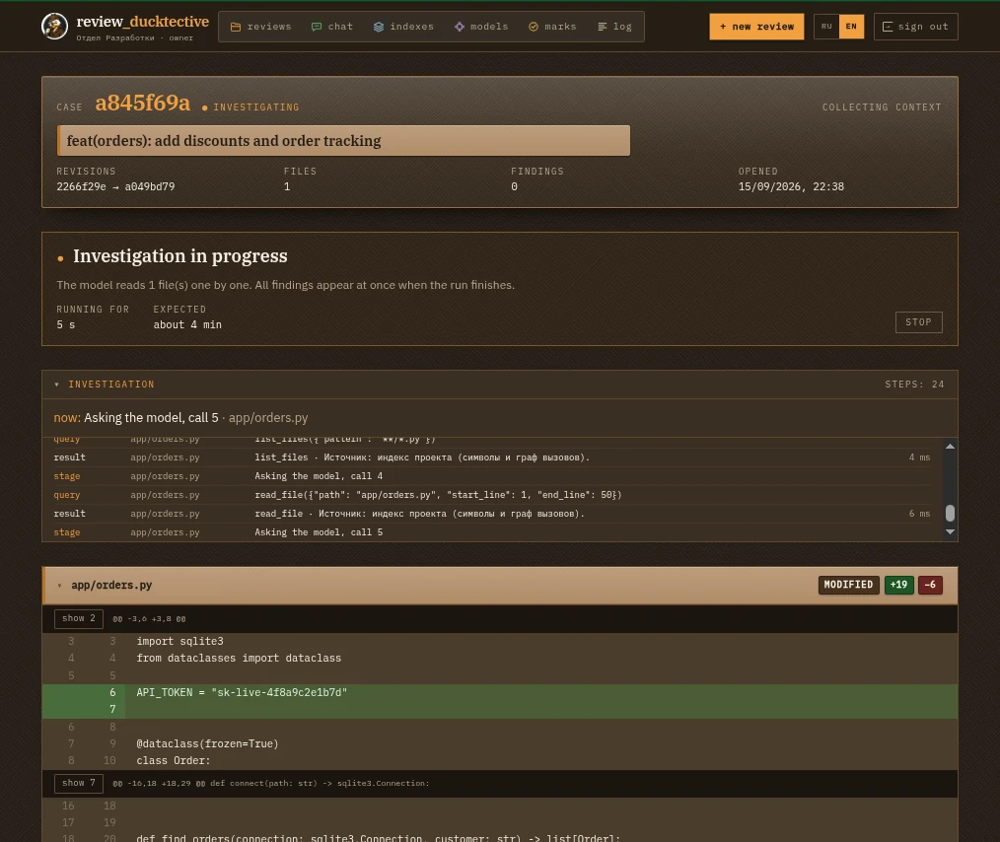
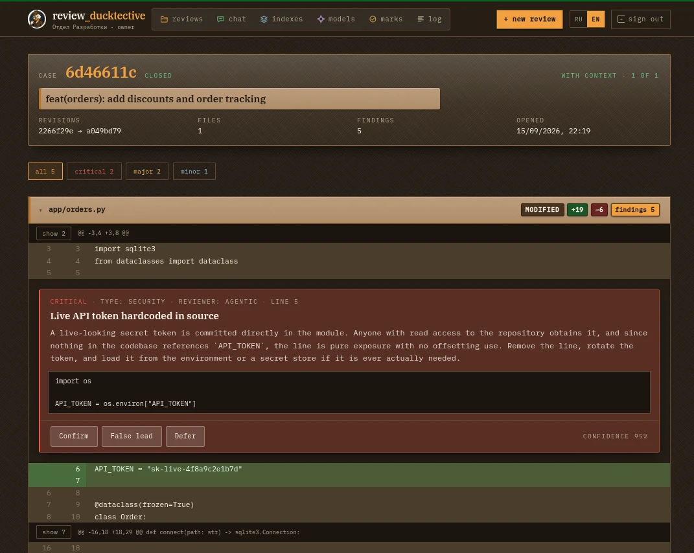
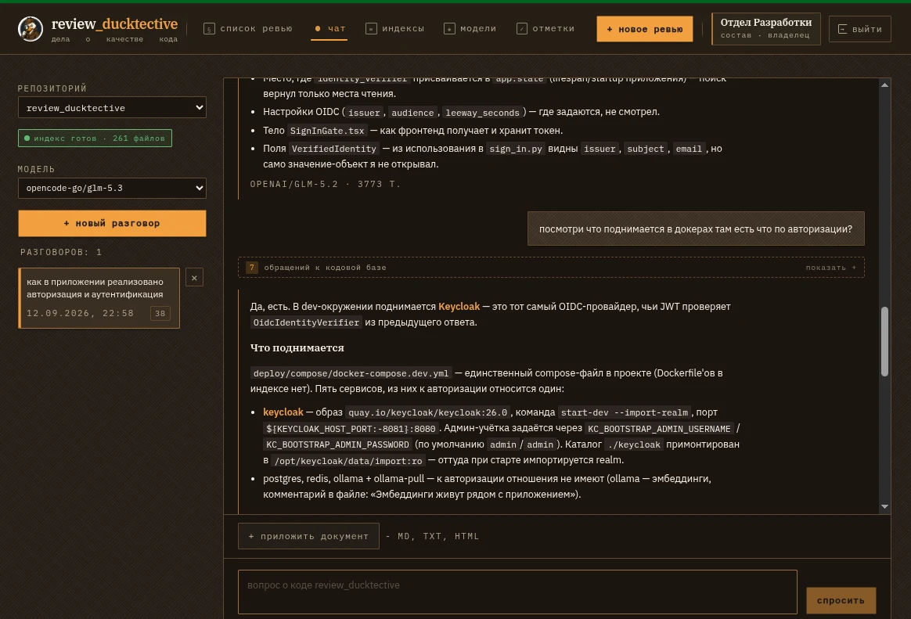
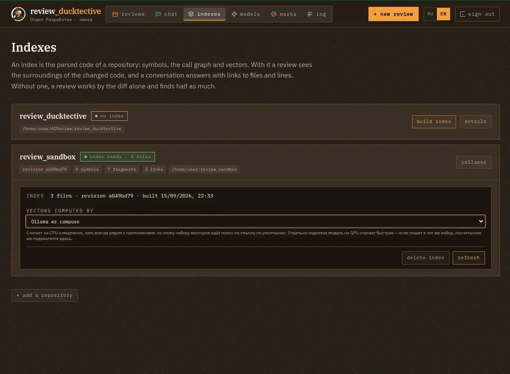
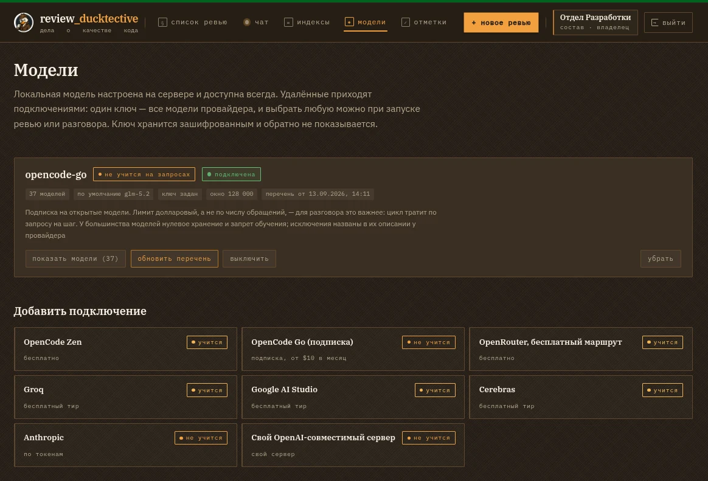
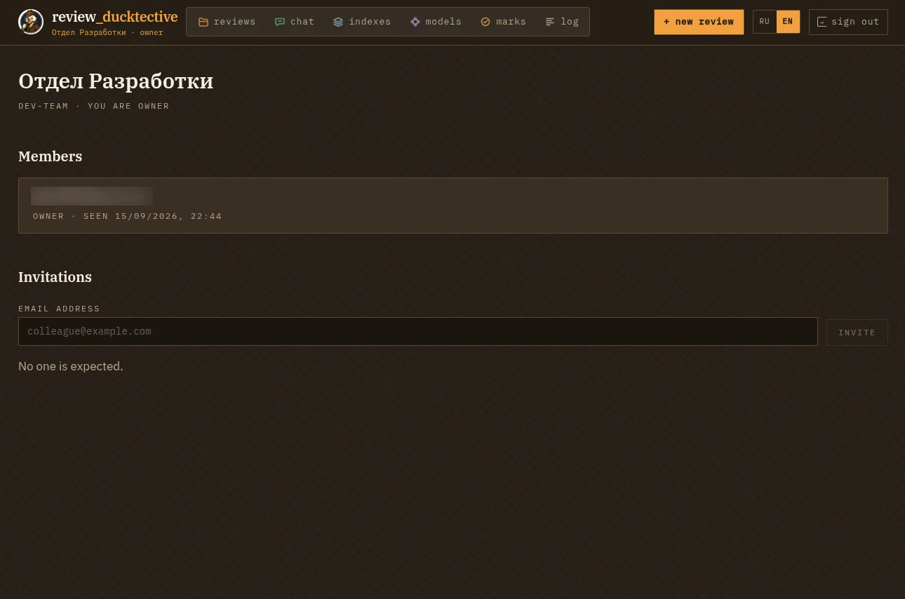

<p align="center">
  
</p>

<h1 align="center">review_ducktective</h1>

<p align="center">
  <b>An LLM code reviewer that investigates instead of guessing.<br>
  It walks the call graph, quotes the real code, and never lets your source leave the machine.</b>
</p>

<p align="center">
  <a href="https://github.com/PavelShaura/review_ducktective/actions"></a>
  
  
  
  
  
  
  
  
  
  <br>
  
  
  
  
  
</p>

---

**review_ducktective** is a self-hosted code review platform. Give it a commit or a
range of revisions and it returns findings pinned to lines of code, ranked by
severity, each one backed by a quote from the actual source. Behind every finding is
an investigation: the model reads the diff, asks who calls the changed function, looks
at the neighbouring files of the same change, reads the definitions it depends on,
checks what reviewers said about this file before — and only then speaks.

It is built for codebases that cannot leave the building. Everything from parsing to
embeddings to the reviewer model can run on your own hardware; a repository marked
`local_only` never produces a single outbound request. When you *do* want a stronger
cloud model for an open-source repository, that is a per-repository policy and a
per-run choice, not a global switch.

## Table of contents

- [The LLM engineering inside](#the-llm-engineering-inside)
- [Why it is different](#why-it-is-different)
- [A tour](#a-tour)
- [How a review works](#how-a-review-works)
- [The index](#the-index)
- [Models, trust and privacy](#models-trust-and-privacy)
- [Chat with the codebase](#chat-with-the-codebase)
- [MCP server](#mcp-server)
- [Organizations and sign-in](#organizations-and-sign-in)
- [Review from the terminal](#review-from-the-terminal)
- [Quality evaluation](#quality-evaluation)
- [Architecture](#architecture)
- [Technology stack](#technology-stack)
- [Quick start](#quick-start)
- [Configuration](#configuration)
- [Development](#development)

## The LLM engineering inside

The project is an end-to-end application of the techniques that make an LLM
system dependable, not a wrapper around one prompt. Each row names the technique,
where it works in this codebase, and the reason it is there.

### Agents and tool use

| Technique | Where it lives | Why |
|---|---|---|
| **Agentic loop with tool calling** — the model asks for tools, the runtime executes them, results go back into the dialogue | `packages/llm/agentic_reviewer.py`, `chat_agent.py`; 13 tools in `tools.py`, `review_tools.py` | a diff alone does not say who calls the changed function; letting the model *look* replaces guessing with reading |
| **LangGraph** state graph with typed state, fan-out per file, a Postgres checkpointer | `packages/review_graph/` — nodes `context → plan → review (Send) → aggregate → verify → report` | a review is a workflow with parallel branches and a resumable state, and the graph makes that explicit and testable |
| **Structured output** — the verdict is requested as a JSON object against a Pydantic schema; a non-JSON reply is retried once with a tighter instruction | `LiteLlmClient.complete(json_schema=…)`, `parse_payload` in `code_reviewer.py` | findings are data with line numbers and evidence, not prose to parse afterwards |
| **Context-window budgeting** — tool results, stop condition and the closing output budget derive from the model's window; a step ceiling only catches loops | `agentic_reviewer.py`: `result_chars_for`, `WINDOW_FILL_LIMIT`, `_closing_requirements` | the same code serves a 16k local model and a 128k cloud one without hand-tuned constants |
| **Self-correction nudges** — a claim about code the model never opened is sent back once; a repeated tool call is refused with a pointer | `UNPROVEN_CLAIM_MESSAGE`, `REPEATED_CALL_MESSAGE` | cheap round-trips that remove whole classes of hallucinated findings |
| **Model Context Protocol server** — the index exposed as MCP tools to Claude Code, Cursor and other agents | `apps/mcp_server/` | the same navigation that helps the reviewer helps any external agent |

### Retrieval (RAG) over a codebase

| Technique | Where it lives | Why |
|---|---|---|
| **AST parsing with tree-sitter** — Python, JavaScript, TypeScript into symbols with exact ranges | `packages/indexing/python_parser.py`, `script_parser.py` | chunks that follow code structure instead of line counts; definitions can be quoted whole |
| **Symbol graph** — calls, inheritance and imports resolved into edges in Postgres | `packages/indexing/references.py`, `symbol_edge` table | "who calls this" and "what breaks" are graph queries, not text searches |
| **Embeddings** — `nomic-embed-text`, 768 dimensions, served locally (Ollama on CPU, or LM Studio on a GPU) with named vector sets | `packages/llm/embedder.py`, `deploy/compose/ollama/prepare.sh` | semantic search over code that never leaves the machine; the same weights on two servers share one vector set |
| **pgvector** — cosine similarity in PostgreSQL next to the graph, findings and checkpoints | `chunk_embedding` table, `packages/retrieval/vector.py` | one transactional store: no separate vector database to keep in sync |
| **Hybrid search with reciprocal rank fusion** — `tsvector` lexical hits and vector hits fused, weights chosen by the shape of the query | `packages/retrieval/hybrid.py`, `lexical.py` | identifiers want exact matches, questions want meaning; RRF takes both without tuning scores |
| **Query expansion** — a prose question is turned into candidate identifiers by a small model call before the search | `packages/llm/query_expansion.py` | "where is upload size checked" has no words in common with `MAX_UPLOAD_BYTES` |
| **Diff-first retrieval** — context for a single-pass review starts from the changed symbols and expands along the graph under a token budget | `packages/retrieval/diff_context.py` | the fallout of a change matters more than a generic top-k over the repository |
| **Incremental indexing** — files compared by git content hash; only changed files parsed, vectors reused by hash; a run indexes its own revision | `packages/application/indexing/` | an index at another commit is worse than none for a review; keeping it fresh must be cheap |

### Grounding and verification

| Technique | Where it lives | Why |
|---|---|---|
| **Evidence gates** — a finding must quote code that exists at the reviewed revision, in the diff or in a tool result; otherwise it is discarded and counted | `packages/core/review/verification.py`, `verify` node | the reviewer's word is not enough; the quote is the proof |
| **Deduplication by defect, not by line** | `aggregate` node | the same defect seen from two files must be one finding |
| **Human feedback loop** — confirmed / false trail / dismissed verdicts fed back to the reviewer as a tool and aggregated into a precision figure | `past_findings` tool, *marks* page | the reviewer learns the team's judgement without fine-tuning |
| **Evaluation harness** — recall on planted defects, false-alarm rate on clean diffs, repeated runs with spread, with and without retrieval | `packages/evals/`, `ducktective eval` | you cannot improve a reviewer you cannot measure; retrieval's effect must be a number |

### Model operations

| Technique | Where it lives | Why |
|---|---|---|
| **LiteLLM** as the single model gateway — Ollama, LM Studio, vLLM, OpenAI-compatible servers, Anthropic, Gemini, OpenRouter, Groq, Cerebras | `packages/llm/client.py` | one client, one retry policy, one place for provider quirks |
| **Model routing by requirements and trust** — a node declares tool calling, a minimum window, deep reasoning; the router picks within the repository's egress policy | `packages/llm/router.py`, `EgressPolicy`, `ModelTrust` | privacy is a domain invariant, not a checkbox; local when possible, remote when allowed |
| **Fallbacks, cooldowns, back-off** — a model that refuses is replaced mid-stream by the next allowed one; rate-limited models rest; retryable errors back off exponentially | `LiteLlmClient.stream`, `_start_cooldown`, `RETRYABLE_ERRORS` | free tiers count requests and an agent spends one per step |
| **Response cache** keyed by model, prompt version, messages and tools, in Redis | `packages/llm/cache.py` | a re-run of the same diff should not pay twice; prompt versions keep old answers from leaking into new prompts |
| **Provider connections with encrypted keys**, presets that state what you pay with — money, quota or your prompts | `provider_connection` table, `packages/core/llm/presets.py` | choosing a model is choosing where code goes; the UI says so |
| **Local inference** — Ollama and LM Studio through the OpenAI-compatible path, a q8 quantised embedding model with all CPU cores | `compose`, `LOCAL_*` settings | the whole system runs on a laptop and in an air-gapped room |

### Streaming, state and the platform

| Technique | Where it lives | Why |
|---|---|---|
| **Streaming** — chat tokens and the investigation trail over WebSocket, fanned out through Redis pub/sub from the workers | `apps/api` WebSocket routes, `RedisStepBroadcaster` | an agent whose steps are invisible is indistinguishable from a hang |
| **Checkpointing and resumption** — LangGraph's Postgres saver keeps run state between super-steps; stop, resume, restart are first-class | `packages/review_graph/checkpointing.py` | a forty-minute run must survive a worker restart and a change of mind |
| **Background workers** on arq with separate queues for indexing and review, deferral while an index builds, time limits that mark the run failed instead of leaving it running | `apps/indexer`, `apps/reviewer` | indexing and review have different load profiles; a stuck run must say why |
| **Multi-tenancy** — Keycloak OpenID Connect, organizations and invitations, PostgreSQL row-level security on every organization-scoped table | `packages/auth`, migration `0022` | a forgotten filter in code must not leak another team's findings |
| **Layered DDD** with aggregates, ports, an explicit Unit of Work and eleven `import-linter` contracts; strict `mypy`; 660+ tests with testcontainers | `packages/core` → `application` → `apps` | the domain rules — evidence, egress, verdicts — stay readable and testable apart from any framework |

## Why it is different

- **Findings are proven, not asserted.** A finding must quote a fragment of code
  that exists at the reviewed revision — in the diff or in something the model actually
  read through a tool. Findings that fail the check are discarded before you see them,
  and the case card reports how many were thrown away and why.
- **The reviewer is an agent with a map of your repository.** The diff is where it
  starts, not where it stops: tree-sitter parses the codebase into symbols, a call graph
  links them, and the model navigates that graph with tools — `find_callers`,
  `get_definition`, `find_references`, `get_file_outline`, `read_file` — while you watch
  every step in the UI.
- **A change is reviewed as a whole.** The reviewer sees the list of other files in
  the same change and can open their patches, so "the callers were not updated" is
  checked against the change itself before it becomes a finding.
- **Offline is a first-class mode, not a demo.** Local models via Ollama or LM Studio
  through one OpenAI-compatible path, embeddings served by a container in `compose`,
  fonts bundled, nothing fetched from a CDN. The egress policy of a repository is a
  domain invariant, enforced by the model router.
- **It learns what you think.** Every finding can be marked *confirmed*, *false trail*
  or *dismissed*; the reviewer reads those marks on the next run of the same file, and
  the *marks* page turns them into a precision figure you can watch move.
- **Production discipline from day one.** Layered DDD with an explicit Unit of Work,
  `import-linter` contracts in CI, strict `mypy`, 660+ tests, Conventional Commits with
  a generated changelog, row-level security in Postgres, structured logging.

## A tour

The screenshots follow one case from start to verdict. The reviewed repository is
this one.

### 1. Open a case

<p align="center">
  
</p>

A case is a repository plus what to review — a single commit or a range of revisions.
The form already knows the state of the index (files, revision, when it was built),
lets you pick **which server computes the vectors** (the Ollama that ships in
`compose`, or a faster model on a GPU host — both write into one vector set) and
**which model reviews**, with its trust level spelled out next to the name:
*does not train on requests* versus *free tier, learns on your prompts*.

If the index was built on a different revision than the one you are about to
review, the form says so and offers to index that revision in one click. This also
happens on its own: a run queues an incremental build for its revision and waits for
it, so the reviewer works with a graph that describes exactly the code under review —
a graph from another commit is worse than none, because the symbols of the change are
simply not in it.

### 2. Watch the investigation

<p align="center">
  
</p>

The case card shows the change (revisions, files, when it was opened), the live
progress, and the **investigation trail**: every thought of the model, every tool it
called with its arguments, every answer it got with its source and timing. The trail
streams over a WebSocket as it happens — you can see the reviewer read
`get_diff_summary`, open the patch of a neighbouring file, look up callers, and
decide it has seen enough.

Below the trail is the diff itself, rendered by changed blocks with the collapsed
stretches expandable on demand; the lines come from the revision, not from the patch.

### 3. Read a finding — and its proof

<p align="center">
  
</p>

A finding sits on the lines it is about. It carries severity (`critical` / `major` /
`minor` / `nitpick`), a category (`correctness`, `security`, `performance`,
`architecture`, `tests`, `style`), which reviewer produced it, the model's confidence,
a plain-language explanation and the **evidence**: the fragment of code the claim
rests on. The fragment was verified against the reviewed revision before the finding
was allowed in.

Three buttons close the loop: **confirm**, **false trail**, **dismiss**. The latest
verdict on a finding is what the reviewer sees the next time it reads that file
(the `past_findings` tool), and what the *marks* page counts.

### 4. Ask the codebase a question

<p align="center">
  
</p>

The same agent, the same tools, a different question. Ask "what comes up in
compose — anything about auth?" and get an answer that names the services, the
config file and the exact variables, with the seven tool calls behind it folded into
one line above the reply. Attach a document — a spec, a ticket — and the agent gets a
`search_document` tool over it. If the chosen model refuses mid-way (a free tier hit
its quota), the reply continues on the next model that fits the repository's policy,
and the switch is announced in the conversation rather than hidden.

### 5. Keep the index alive

<p align="center">
  
</p>

Every registered repository with its index: files, symbols, fragments, resolved call
edges, the revision, and the two layers of the index — *symbols and graph* (ready
first) and *vectors* (computed after, by the server you chose). Builds are
incremental, cancellable, and show what they are doing — parsing, storing, linking,
embedding — with a moving counter, because a bar that stops moving looks like a hang.

### 6. Connect models

<p align="center">
  
</p>

A local model is always there. Remote ones come as **connections**: one key gives
you every model of a provider, refreshed from the provider itself. Presets for the
usual suspects (OpenRouter, Groq, Google AI Studio, Cerebras, Anthropic, OpenCode,
any OpenAI-compatible server) come with an honest note of what you pay with — money,
a daily quota, or your prompts. Keys are stored encrypted and are never shown back.

### 7. Work as a team

<p align="center">
  
</p>

Sign-in goes through Keycloak (OpenID Connect). An organization owns repositories,
runs, conversations and model connections; members join by invitation, owners
decide the egress policy of a repository and the model connections — both are
decisions about where code may travel. Isolation is enforced by row-level security
in Postgres, not only by filters in code.

## How a review works

A run is a [LangGraph](https://github.com/langchain-ai/langgraph) graph with typed
state and a Postgres checkpointer. Here is what happens between "start review" and
the findings appearing.

```
open case ──▶ parse diff ──▶ ensure index at revision ──▶ plan
                                                            │
              ┌─────────────────────────────────────────────┘
              ▼
   per file (fan-out) ──▶ agentic investigation ──▶ structured verdict
              │
              ▼
   aggregate ──▶ verify evidence ──▶ deduplicate ──▶ persist ──▶ notify
```

**Parse the diff.** The unified diff is split into files and hunks and stored; every
file knows its language, change type and line counts. Binary and generated files are
recognised and not sent to the model.

**Ensure the index.** If there is no ready index at the reviewed revision, an
incremental build is queued and the review waits for it (the job defers itself every
15 seconds instead of holding a worker slot). Only changed files are re-parsed;
vectors are reused by content hash.

**Plan.** The planner decides the mode — agentic when a tool-capable model within
the repository's policy exists, single-pass otherwise — and the budgets.

**Investigate, one file at a time.** Each file is a dialogue with the model. The
model gets the patch, a system prompt describing what a good finding is, and a
toolbox:

| Tool | What it answers |
|---|---|
| `get_diff_summary`, `get_file_diff` | what else changed in this same change, and the patch of any of it |
| `search_code` | where is this done — hybrid search, by meaning and by literal |
| `find_symbol`, `get_definition`, `get_file_outline` | what is this thing, what does a file define |
| `find_callers`, `find_references` | who depends on it — call graph, inheritance, imports |
| `get_file_context`, `read_file` | the code around these lines / these exact lines |
| `list_files`, `project_docs`, `describe_repository` | what is in the repository and what its docs say |
| `past_findings` | what reviewers found here before and what the humans said about it |

Every answer is stamped with its source — *project index (symbols and call graph)*
or *git at the reviewed revision, word search without a graph* — because an empty
result means different things in each case, and the model has to know which.

The loop's limits derive from the model's context window, not from constants: each
tool result may take a thirty-second of the window, the dialogue stops when it fills
three quarters of it, and a step ceiling (`AGENT_MAX_STEPS`) only catches a model going
in circles. A repeated call with the same arguments is refused with a pointer to the
step that already holds the answer. When the loop ends, the model is asked for its
verdict as a JSON object; a reasoning model gets an output budget of an eighth of its
window for that, because it thinks in the same budget it writes in.

**Fall back honestly.** No tool-capable model, a dialogue that outgrew the window,
a verdict that would not parse — the file gets a single-pass review of its diff
instead, and the trail says so. A file without a review must never look like a file
without findings.

**Verify.** Every proposed finding passes four gates before it is stored:
it must point inside the diff; its evidence must be a real quote from the reviewed
revision or from something a tool returned; a claim about code outside the diff
("this breaks all callers") must be backed by a tool call that looked at that code —
the model is sent back once to check, then the claim is dropped; and duplicates of one
defect from several angles are merged, keeping the best-supported representative.
The case card reports the counts: proposed, discarded outside the diff, discarded
without evidence, discarded as unproven, merged as duplicates.

**Persist and notify.** Findings and the trail are written in one transaction; the
UI gets the news over Redis pub/sub → WebSocket. A run can be **stopped** between
model calls, **resumed** from its checkpoint (files already read stay read), or
**restarted** from scratch. A run that outlives the worker's time limit is marked
failed with the reason and can be resumed.

## The index

The index is what turns "review this diff" into "review this change in this
codebase". It lives entirely in PostgreSQL.

**Parsing.** [tree-sitter](https://tree-sitter.github.io/) grammars for Python,
JavaScript and TypeScript produce symbols (modules, classes, functions, methods) with
exact byte and line ranges, signatures and docstrings. HTML, CSS/SCSS, Markdown, YAML,
TOML, JSON, Dockerfiles and plain text are chunked by blank lines with a hard cap, so
a minified file does not become a single 4 000-token fragment.

**Graph.** References found during parsing become edges: calls, inheritance,
imports. Edges are resolved against the symbol table in a second pass, so a call to
`ReportBuilder.build` links to the definition wherever it lives; unresolved names are
kept as names — a partial graph of a dynamic language is still worth a lot.

**Chunks and search.** Every symbol body and every text block is a chunk with a
`tsvector` for lexical search and a 768-dimensional vector in
[pgvector](https://github.com/pgvector/pgvector). Search is **hybrid**: lexical and
vector results are fused with reciprocal rank fusion, weighted by how the question
looks — an identifier leans on words, a sentence leans on meaning. Prose questions are
first translated into candidate identifiers by a small model call before hitting the
index.

**Vectors.** Embeddings come from `nomic-embed-text` (137M parameters, 768
dimensions). A quantised copy runs in the Ollama container that `compose` starts, on
CPU, with all cores; a faster server with the same weights — LM Studio on a GPU host —
can be added to `embedding_backends.json` and chosen per build. Servers that declare
the same `vector_set` write into one set of vectors, so nothing is recomputed when you
switch. Generated and vendored paths (migrations, fixtures, minified assets, lock
files) get no vectors at all: the graph and word search still cover them, semantic
search never needed them.

**Incremental and honest.** Files are compared by the content hash git already has;
an unchanged file is not even read. The two layers of the index are reported
separately — *symbols and graph* are ready first and useful on their own, *vectors*
follow — and the UI says "computing", "stopped" or "not started" only when the server
says so, never by guessing from a percentage.

## Models, trust and privacy

All model access goes through [LiteLLM](https://github.com/BerriAI/litellm), so
Ollama, LM Studio, vLLM, llama.cpp, OpenRouter, Groq, Gemini, Cerebras, Anthropic and
any OpenAI-compatible server speak one protocol. Above it sits a **ModelRouter** that
chooses a model per node of the graph from what the node needs (tool calling, a
minimum window, deep reasoning) and what the repository allows.

Three trust levels describe every model:

| Level | Meaning | Examples |
|---|---|---|
| `local` | code never leaves the machine | Ollama, LM Studio |
| `private_remote` | a provider that promises not to train on requests | Anthropic, OpenCode Go, paid tiers |
| `training_remote` | no such promise — assumed to learn on your prompts | free tiers of OpenRouter, Gemini, Groq |

Every repository has an **egress policy** that sets the highest level it accepts.
The router never picks above it, the UI only offers models within it, and a model the
user picked explicitly is honoured only if it passes. Model connections belong to the
organization: one key, every model of the provider, encrypted at rest with a master
secret that stays outside the database. Provider-specific requirements — OpenCode Go
wants a stable session id and a named user agent — are handled in the client, keyed by
the run or conversation.

The reviewer model, the chat model and the embedding model are configured
independently; the defaults are local.

## Chat with the codebase

The chat is the review agent turned towards a question instead of a diff: the same
navigation tools, the same window budgeting, the same trail — streamed over a
WebSocket, token by token. A conversation remembers its history and its chosen model;
a document attached to it becomes searchable with a dedicated tool rather than pasted
into the prompt whole. Conversations belong to a repository and inherit its egress
policy.

## MCP server

Ducktective parses your codebase and builds a reference book out of it: where each
symbol starts and ends, who calls whom, which fragment is about what. The MCP server
opens that reference book up — Claude Code, Cursor, and other clients can look things
up in it.

| Tool | Answers the question |
|---|---|
| `list_repositories` | which codebases are indexed, and how fresh they are |
| `search_code` | where is this done — by meaning, not by literal text |
| `get_definition` | what does this symbol look like in full |
| `find_callers` | who calls it, i.e. what would break |
| `get_file_context` | what's going on at these lines of a file |

Where it shines is the connections `grep` chokes on: "who calls this," "where else
is this done," "what covers these lines." Same-named symbols all come back; graph
neighbours come back as a signature, without the body.

What it deliberately won't do: **git history** (your client already has `git log`),
**the working copy** (answers describe a committed revision; mixing in half-written
code would stop the index from being trustworthy), and **review runs** (findings and
marks live in other tables — this server doesn't read them). Every answer is stamped
with the index revision and build date.

The default transport is stdio — the client starts the server itself, so you point at
your `.env` explicitly:

```bash
claude mcp add ducktective -- \
  /path/to/review_ducktective/.venv/bin/ducktective-mcp \
  --env-file /path/to/review_ducktective/.env
```

```json
{
  "mcpServers": {
    "ducktective": {
      "command": "/path/to/review_ducktective/.venv/bin/ducktective-mcp",
      "args": ["--env-file", "/path/to/review_ducktective/.env"]
    }
  }
}
```

A standalone service runs off the same executable:

```bash
uv run ducktective-mcp --transport http --port 8090
```

The tenant is set with `--tenant` or `MCP_TENANT_ID`: stdio has no caller identity,
so the server runs as whoever started it.

## Organizations and sign-in

Sign-in is OpenID Connect through **Keycloak**, which `compose` starts with a
pre-imported realm. The first sign-in creates a user and an organization; further
members join by invitation link. Roles are *owner* and *member*: owners change the
egress policy of a repository and manage model connections — the two operations that
decide where code goes.

Multi-tenancy is enforced twice: use cases check ownership and explain a refusal,
and PostgreSQL **row-level security** policies on every organization-scoped table
catch a forgotten filter. The CLI signs in with the OAuth device flow
(`ducktective login`) and works as that user.

## Review from the terminal

Standalone mode: no database, no Redis, no running API. All you need is a local
model — the code goes nowhere.

```bash
ducktective review --staged --no-store                        # what you're about to commit
ducktective review /path/to/repo --no-store --base HEAD~1 --head HEAD
ducktective review --staged --no-store --format markdown      # a report for a pull request
```

Output formats: `rich` (default), `json`, `markdown`. `--include` narrows a big
commit to the part you care about (`*` spans directory separators). With
`--fail-on`, the command returns a non-zero exit code at the given severity or above,
which makes it a git hook and a CI gate:

```bash
ducktective review --staged --no-store --fail-on major
```

```yaml
# .pre-commit-config.yaml
- repo: local
  hooks:
    - id: ducktective
      name: ducktective
      entry: ducktective review --staged --no-store --fail-on critical
      language: system
      pass_filenames: false
```

Stored mode (without `--no-store`) writes runs and findings to the database — that
is how findings get marked and quality gets measured.

Indexing from the terminal:

```bash
ducktective index .                    # current revision
ducktective index . --revision HEAD~5  # any other one
ducktective index . --skip-embeddings  # parsing and the graph only
```

## Quality evaluation

Case sets with known-good answers live outside the repository — they contain code
that has no business being here. A run measures recall on planted defects and the
false-alarm rate on diffs known to be clean:

```bash
ducktective eval cases.json --label baseline --repeat 3 --save

# with context from the index — this is how you measure the retrieval effect
ducktective eval cases.json --label with-context --repeat 3 \
  --repository . --tenant <id> --save
```

`--repeat` is not about reliability: the model answers the same prompt differently
each time, and a single run measures luck. The report prints the spread next to the
average, and the "cases with context" line shows whether the index actually took
part.

The *marks* page is the other half of evaluation: verdicts left by humans on real
findings, counted per repository, with the share of confirmed ones.

## Architecture

Layered DDD. `apps` depend on `application`, `application` on `core`; infrastructure
packages implement the ports the domain declares. Data access goes only through
aggregate repositories, and every transaction boundary is an explicit **Unit of
Work** opened in a use case — repositories never commit, and nothing inside an open
transaction calls a model, git or a linter. The dependency rule is enforced by
eleven `import-linter` contracts in CI.

```
packages/core           domain: aggregates, value objects, events, ports, verification rules
packages/application    use cases and transaction boundaries
packages/storage        SQLAlchemy 2.0 async models, repositories, Unit of Work, Alembic migrations, RLS
packages/indexing       tree-sitter parsers, chunking, symbol graph, hashing
packages/retrieval      hybrid search, diff-first context builder, navigators (index and git)
packages/llm            LiteLLM client, ModelRouter, agentic reviewer and chat agent, toolboxes, cache
packages/review_graph   LangGraph nodes, state, checkpointing, pipeline port implementation
packages/vcs            git: diffs, revisions, trees, a git-backed navigator for unindexed revisions
packages/auth           OIDC, sessions, device flow
packages/evals          case sets, harness, metrics, reports
packages/config         settings, queues, model and embedder registries
packages/observability  structured logging
apps/api                FastAPI: REST, WebSocket streams, CLI entry points
apps/indexer            arq worker: build_index_task
apps/reviewer           arq worker: run_review_task, checkpoint cleanup
apps/mcp_server         MCP tools over the index
apps/web                React + TypeScript + Vite interface
```

Two workers with separate queues, because indexing and review have different load
profiles; each can be scaled on its own. Domain events are published after commit
and fanned out through Redis to WebSocket subscribers. Run state between graph
super-steps is held by the LangGraph Postgres checkpointer — that is what makes
*stop* and *resume* possible.

Decisions and their rejected alternatives are recorded as numbered ADRs in
`docs/adr/`, starting with the one on layering and the Unit of Work.

## Technology stack

| Area | Choice | Why this one |
|---|---|---|
| Language | Python 3.12+, fully typed, `mypy` strict | domain logic reads like the docs that describe it |
| API | FastAPI, Pydantic v2 | async end to end, OpenAPI schema drives the frontend types |
| Agent graph | LangGraph with a Postgres checkpointer | typed state, fan-out per file, resumable runs |
| Model access | LiteLLM | one protocol for local and remote providers, structured output, tool calls |
| Storage | PostgreSQL 17 + pgvector | vectors, the symbol graph, findings and checkpoints in one transactional store — no second database to keep consistent |
| Queue and events | Redis + arq | small, async, retries and deferral built in; pub/sub for live streams |
| Parsing | tree-sitter | exact symbol ranges across languages without running the code |
| Embeddings | nomic-embed-text via Ollama (CPU) or any OpenAI-compatible server | 768 dimensions, Apache 2.0, runs anywhere |
| Sign-in | Keycloak, OpenID Connect | organizations and invitations without writing an auth server |
| ORM and migrations | SQLAlchemy 2.0 async, Alembic | explicit sessions, explicit transactions |
| Frontend | React, TypeScript, Vite, TanStack Query | generated API types, no CDN at runtime |
| Quality | ruff, isort, mypy, import-linter, pytest, testcontainers, pre-commit, commitizen | the layers and the commit history stay honest |

## Quick start

Requirements: Python 3.12+, [uv](https://docs.astral.sh/uv/), Docker with Compose.

```bash
uv sync --all-packages
cp .env.example .env

docker compose --env-file .env -f deploy/compose/docker-compose.dev.yml up -d
uv run alembic upgrade head
uv run ducktective dev
```

Compose brings up Postgres, Redis, Keycloak and an Ollama that serves the embedding
model: `ollama-pull` fetches it into a volume on the first start (about 270 MB) and
builds the quantised copy, so vectors never depend on a GPU host being awake. For an
air-gapped install, fill the `ollama_models` volume beforehand.

`ducktective dev` starts the API, both workers and the frontend, merges their logs
into one stream tagged by source, and shuts everyone down on Ctrl+C:

```bash
uv run ducktective dev --reload        # restart the API on changes
uv run ducktective dev --no-web        # without the frontend
uv run ducktective dev --no-workers    # API only
```

Or one at a time:

```bash
uv run ducktective serve --reload
uv run arq ducktective.reviewer.worker.WorkerSettings   # review
uv run arq ducktective.indexer.worker.WorkerSettings    # indexing
cd apps/web && npm install && npm run dev               # interface on :5173, proxied to :8000
```

Then open http://localhost:5173, sign in (the dev realm lets you register), register a
repository by its local path, and open a case. Health: http://localhost:8000/health,
API docs: http://localhost:8000/docs.

## Configuration

Everything is in `.env` (see `.env.example`, every variable is explained there).
The ones you will touch first:

| Variable | What it does |
|---|---|
| `LOCAL_LLM_PROVIDER`, `LOCAL_LLM_BASE_URL`, `LOCAL_REVIEW_MODEL` | the local reviewer model — Ollama on this machine or LM Studio on a GPU host |
| `LOCAL_REVIEW_MODEL_CONTEXT_WINDOW`, `LOCAL_REVIEW_MODEL_SUPPORTS_TOOLS` | what the loaded model can do; the router decides the mode from this |
| `LOCAL_EMBEDDING_MODEL`, `LOCAL_EMBEDDING_BASE_URL`, `LOCAL_EMBEDDING_VECTOR_SET` | the default embedding server and the name of its vector set |
| `EMBEDDING_BACKENDS_FILE` | extra embedding servers offered in the index panel (`embedding_backends.example.json`) |
| `REMOTE_MODELS_FILE` | installation-wide remote models (`remote_models.example.json`); organizations add their own in the UI |
| `MODELS_SECRET_KEY` | encrypts provider keys at rest — losing it means re-entering the keys |
| `AGENT_MAX_STEPS`, `LLM_MAX_OUTPUT_TOKENS` | the agent's step ceiling and output budget |
| `REVIEW_JOB_TIMEOUT_SECONDS`, `REVIEW_MAX_JOBS`, `INDEX_MAX_JOBS` | worker limits |
| `KEYCLOAK_*` | the sign-in realm |

## Development

```bash
uv run pre-commit install --install-hooks
uv run pre-commit install --hook-type commit-msg   # commit convention check
uv run pytest -m "not integration"                 # fast, no containers
uv run pytest                                      # everything, with testcontainers
uv run mypy .
uv run lint-imports
```

Formatting — strictly in this order, isort first:

```bash
uv run isort . && uv run ruff format . && uv run ruff check --fix .
```

Migrations:

```bash
uv run alembic upgrade head
uv run alembic revision --autogenerate -m "description"
```

Frontend:

```bash
cd apps/web
npm run typecheck
npm run build
npm run codegen     # refresh API types from openapi.json
```

Commits follow [Conventional Commits](https://www.conventionalcommits.org/); the
version and CHANGELOG are generated automatically.

## License

MIT.
